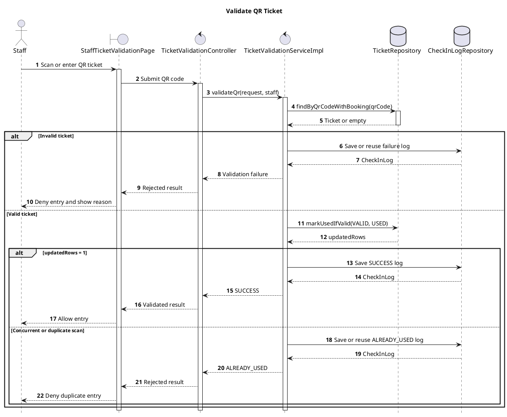

# Validate QR Ticket Sequence Diagram Implementation Plan

> **For agentic workers:** REQUIRED SUB-SKILL: Use superpowers:subagent-driven-development (recommended) or superpowers:executing-plans to implement this plan task-by-task. Steps use checkbox (`- [ ]`) syntax for tracking.

**Goal:** Produce a concise, report-ready PlantUML sequence diagram for UC-13 Validate QR Ticket and export a rendered PNG when a local PlantUML runtime is available.

**Architecture:** Represent the implemented request path from Staff through the React validation page, Spring controller and service, then the ticket and check-in-log repositories. Use one nested alternative structure to distinguish invalid, successful, and concurrent/duplicate outcomes while keeping implementation-only scanner details out of the report diagram.

**Tech Stack:** PlantUML, Java/PlantUML CLI or compatible local renderer, PowerShell verification commands

## Global Constraints

- Include exactly these six participants: Staff, StaffTicketValidationPage, TicketValidationController, TicketValidationServiceImpl, TicketRepository, and CheckInLogRepository.
- Keep labels short and in English.
- Use numbered messages, activation bars, and the project's light-blue diagram style.
- Show invalid, valid, and concurrent/duplicate outcomes.
- Do not include camera initialization, QR decoding libraries, HTTP authentication internals, DTO construction, or frontend cooldown state.

---

### Task 1: Create and export the report sequence diagram

**Files:**
- Modify: `docs/diagrams/validate-qr-ticket-sequence-diagram.puml`
- Create when rendering is available: `docs/diagrams/validate-qr-ticket-sequence-diagram.png`

**Interfaces:**
- Consumes: UC-13 behavior documented in `docs/superpowers/specs/2026-07-12-validate-qr-ticket-sequence-diagram-design.md` and implemented by `TicketValidationServiceImpl.validateQr(...)`.
- Produces: A standalone PlantUML source file and a report-ready PNG with the same basename.

- [ ] **Step 1: Replace the PlantUML source with the approved concise diagram**



- [ ] **Step 2: Verify the source structure**

Run:

```powershell
$file = 'docs/diagrams/validate-qr-ticket-sequence-diagram.puml'
$text = Get-Content -Raw $file
@('@startuml', '@enduml', 'actor Staff', 'StaffTicketValidationPage', 'TicketValidationController', 'TicketValidationServiceImpl', 'TicketRepository', 'CheckInLogRepository', 'Invalid ticket', 'Valid ticket', 'Concurrent or duplicate scan') | ForEach-Object { if (-not $text.Contains($_)) { throw "Missing required content: $_" } }
```

Expected: command exits successfully with no missing-content error.

- [ ] **Step 3: Render and inspect the PNG**

Run when `plantuml` is available:

```powershell
plantuml -tpng 'docs/diagrams/validate-qr-ticket-sequence-diagram.puml'
```

Expected: `docs/diagrams/validate-qr-ticket-sequence-diagram.png` exists, contains six readable lifelines, and shows all three outcomes without clipped or overlapping labels. If no PlantUML runtime exists locally, retain the verified `.puml` as the deliverable and report that PNG export was unavailable.

- [ ] **Step 4: Review the final diff**

Run:

```powershell
git diff --check -- docs/diagrams/validate-qr-ticket-sequence-diagram.puml
git diff -- docs/diagrams/validate-qr-ticket-sequence-diagram.puml
```

Expected: no whitespace errors; the diff matches the approved concise design and introduces no unrelated changes.

- [ ] **Step 5: Commit the diagram artifacts**

```powershell
git add docs/diagrams/validate-qr-ticket-sequence-diagram.puml
if (Test-Path 'docs/diagrams/validate-qr-ticket-sequence-diagram.png') { git add docs/diagrams/validate-qr-ticket-sequence-diagram.png }
git commit -m "docs: add validate QR ticket sequence diagram"
```
